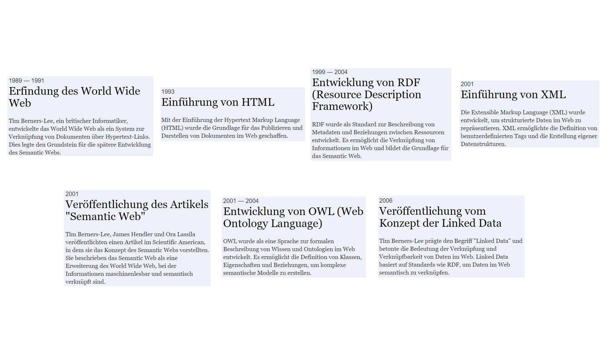
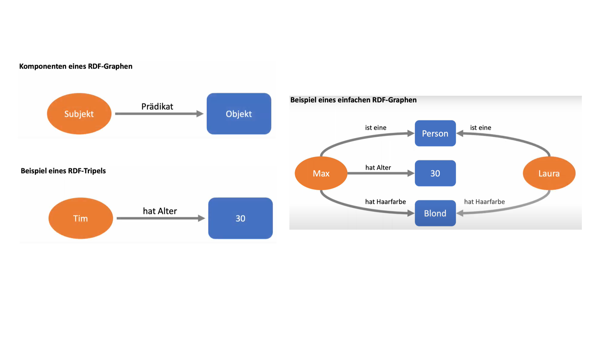

# OER zu Knowledge Graphen (in Arbeit!)       

In dieser Open Educational Resource (OER) lernst du, wie die Wissensmodellierung in Knowledge Graphen strukturiert ist, aus welchen Elementen sich die übergeordnete Vision des Semantic Webs zusammensetzt und mit welchen Techniken heutzutage praktische Anwendungsbeispiele von diesen Konzepten profitieren können. 

**Nachdem du das folgende OER abgeschlossen hast, wirst du wissen:**

* Was Knowledge Graphen, das Semantic Web und Linked Data sind
* Wie die übergeordnete Vision eines Semantic Web aussieht und in wie weit die Vision zur Realität geworden ist 
* Welche technischen Ansätze zur Umsetzung entwickelt wurden 
* Was es für praktische Anwendungsbeispiele im Kontext von Geodateninfrastrukturen gibt 
* Wie du selbst einfache Abfragen erstellen kannst und Ansätze des Semantic Web für dich nutzen kannst

**Das OER ist wie folgt aufgebaut**

1. Überblick
2. Thematischer Hintergrund 
3. Übungen und Leitfäden
4. Quiz 
5. Zusammenfassung 

**Generelle Informationen**

Dieses Tutorial richtet sich hauptsächlich an Teilnehmer, die in etwa 30 Minuten ihre Kenntnisse zu den Konzepten der Knowledge Graphen, dem Semantic Web und Linked Data verbessern wollen.

Dieses Tutorial wurde am Institut für Geodäsie der Fachhochschule Bochum in enger Zusammenarbeit mit der Universität Münster und der Universität Bochum entwickelt. Hauptautor ist Fabian Przybylak unter der Leitung von Prof. Dr. Carsten Keßler und in Zusammenarbeit mit Lucas Rudnik.

Du darfst das OER (H5P-Inhalte) unter den Bedingungen der CC-BY-SA 4.0-Lizenz frei verwenden, verändern und vervielfältigen. Jeglicher Code, der mit dem OER zur Verfügung gestellt wird, kann unter den Bedingungen der MIT-Lizenz verwendet werden. Bitte lesen Sie die [vollständigen Lizenzbedingungen](/LICENSE.md). 

Das Projekt OER4SDI wurde von der Digitalen Hochschule NRW empfohlen und wird durch das Ministerium für Kultur und Wissenschaft NRW gefördert.

## 2. Thematischer Hintergrund

**Gliederung des thematischen Hintergrunds**
* Kurze Einleitung mit allgemeinem Kontext und Hintergrund (in wenigen Sätzen) 
* Inhaltliche Vertiefung (Texte welche die gegebenen Informationen zusammenfasst + Videoformat)

### 2.1 Kurze Einführung

**Die Geschichte des Semantic Web, der Knowledge Graphen und des Linked Data Konzepts**

Eine syntaktische Interoperabilität bezieht sich auf den korrekten Austausch von Daten, basierend auf gemeinsamen Standards für die Datenstruktur und das Format. Eine semantische Interoperabilität hingegen betrifft das einheitliche Verständnis und die Interpretation der Bedeutung und des Kontexts der Daten. Während die syntaktische Interoperabilität sicherstellt, dass Daten fehlerfrei übertragen werden, ermöglicht die semantische Interoperabilität ein gemeinsames Verständnis der Dateninhalte und deren korrekte Interpretation im entsprechenden Kontext. Beide Aspekte sind wichtig, um effektive Kooperation und Kommunikation zwischen verschiedenen Systemen zu gewährleisten.

Ein Semantisches Web ist mittlerweile keine neue Idee mehr, aber die Vision hat nichts von ihrer Aktualität verloren. Um die aktuellen Entwicklungen zu verstehen, kann ein Blick zurück zu den Anfängen sehr aufschlussreich sein:

### 2.2 Inhaltliche Vertiefung - Konzepte und Vision(Video)

**Die Vision eines Semantic Webs**

Das Semantic Web ist ein Konzept, dass von Tim Berners-Lee, dem Erfinder des World Wide Web, geprägt wurde. Es handelt sich dabei um eine Erweiterung des klassischen Web, die darauf abzielt, die Maschinenlesbarkeit von Informationen im Web zu verbessern und somit die Effizienz und die Qualität der Webanwendungen zu steigern.

Das klassische Web ist eine unerschöpfliche Quelle von Informationen, aber die meisten Informationen sind unstrukturiert und nur für menschliche Leser verständlich. Im Gegensatz zum klassischen Web, in dem Informationen von Menschen gelesen werden, sollen Maschinen durch das Semantic Web in der Lage sein, Informationen automatisch zu verarbeiten und zu verstehen. Dadurch können neue Anwendungen und Dienste entwickelt werden, die auf intelligentere Weise mit den Informationen im Web umgehen.

**Die Integration des Linked Data Konzepts**

Linked Data ist ein Konzept, dass auf dem Semantic Web aufbaut. Es bezieht sich auf die Verknüpfung von Daten, die auf verschiedenen Webseiten und in verschiedenen Datenbanken gespeichert sind. Dadurch können Daten automatisch verknüpft und abgefragt werden, ohne dass der Benutzer die genaue Speicherposition oder Datenstruktur kennen muss. Linked Data spielt eine wichtige Rolle im Semantic Web, da es dazu beiträgt, die Vernetzung von Informationen zu fördern und somit das Potenzial des Semantic Web voll auszuschöpfen.

**Die Entwicklung von Knowledge Graphen**

Ein Knowledge Graph ist eine strukturierte Datenbank, die Informationen über Entitäten und deren Beziehungen enthält. Wissen wird in Form von Graphen dargestellt, wobei Knoten Entitäten und Kanten Beziehungen zwischen den Entitäten repräsentieren.

Im Gegensatz zu herkömmlichen Datenbanken, die oft tabellarisch organisiert sind, ermöglicht ein Knowledge Graph eine flexible Darstellung von Wissen und kann semantische Zusammenhänge zwischen verschiedenen Entitäten erfassen. Die Funktionsweise basiert auf dem Konzept des semantischen Webs und oft wird das Resource Description Framework (RDF) als Datenmodell genutzt.

Ein Knowledge Graph kann Informationen aus verschiedenen Quellen wie strukturierten Datenbanken, unstrukturierten Texten, Webseiten, APIs usw. zusammenführen. Dies erlaubt es, Wissen in einer maschinenlesbaren Form zu speichern und ermöglicht so die Verknüpfung und Abfrage von Informationen auf einer tieferen semantischen Ebene.

Knowledge Graphen werden in verschiedenen Bereichen eingesetzt, wie zum Beispiel in der Wissensorganisation, der semantischen Suche, der Datenintegration, dem maschinellen Lernen und der künstlichen Intelligenz. Sie bieten eine Grundlage für die Entwicklung von intelligenten Systemen, die Wissen verstehen, analysieren und daraus Schlussfolgerungen ziehen können.

### 2.3 Inhaltliche Vertiefung - Technische Umsetzung (Video)

Um Ansätze der technischen Umsetzung verstehen zu können müssen einige Schlüsseltechnologien und Begriffe erläutert werden.

**Kurz erklärt: Uniform Resource Identifier (URI)**

Uniform Resource Identifier (URI) sind Zeichenketten, die verwendet werden, um Ressourcen im World Wide Web eindeutig zu identifizieren. Eine URI dient als globaler Bezeichner für eine Ressource, sei es eine Webseite, eine Datei, ein Bild oder eine andere Art von digitaler Information.

URIs bestehen aus zwei Hauptkomponenten: dem Schema und dem spezifischen Identifikator. Das Schema gibt an, wie der Identifikator zu interpretieren ist, und kann beispielsweise "http://" für eine Webseite oder "file://" für eine lokale Datei sein. Der spezifische Identifikator ist der Teil, der die genaue Adresse oder den Pfad zur Ressource angibt.

Es gibt verschiedene Arten von URIs. Die bekannteste Form ist die Uniform Resource Locator (URL), die normalerweise verwendet wird, um Webseiten zu adressieren. 
*Eine URL enthält das Schema (z. B. "http://"), gefolgt von der Domain (z. B. "www.example.com") und dem Pfad zur spezifischen Ressource (z. B. "/pfad/zur/datei.html").*

Ein weiterer Typ ist der Uniform Resource Name (URN), der dazu dient, Ressourcen unabhängig von ihrem aktuellen Speicherort dauerhaft und eindeutig zu identifizieren. URNs können verwendet werden, um zum Beispiel auf bibliografische Informationen, Dokumente oder andere digitale Objekte zu verweisen.

URIs spielen eine zentrale Rolle im Web, da sie die Grundlage für das Adressieren und Verlinken von Ressourcen bilden. Durch die Verwendung von URIs können Benutzer und Maschinen auf die gewünschten Ressourcen zugreifen, sei es durch das Eingeben der URI in einen Webbrowser oder durch das Klicken auf Hyperlinks, die auf URIs verweisen.

Es ist wichtig anzumerken, dass URLs und URNs eng miteinander verwandt sind und beide als Untergruppe von URIs betrachtet werden können. URLs dienen jedoch hauptsächlich dazu, Ressourcen zu lokalisieren, während URNs auf ihre Identität abzielen.

**Kurz erklärt: Resource Desciption Framework**

RDF (Resource Description Framework) ist ein Datenmodell des Semantic Web, das verwendet wird, um strukturierte Informationen über Ressourcen im Web zu beschreiben und zu verlinken.

Das RDF-Modell besteht aus drei grundlegenden Komponenten: Ressourcen, Eigenschaften und Werten. Eine Ressource wird durch eine URI (Uniform Resource Identifier) identifiziert und repräsentiert eine Entität im Web wie z.B. eine Person, ein Ort oder ein Dokument. Eine Eigenschaft (auch Prädikat genannt) beschreibt eine Beziehung zwischen zwei Ressourcen und wird ebenfalls durch eine URI identifiziert. Ein Wert gibt an, welcher Wert die Eigenschaft für die Ressource hat, die sie beschreibt.

RDF-Daten werden in Tripeln ausgedrückt, die aus einem Subjekt, einem Prädikat und einem Objekt bestehen. Das Subjekt ist die Ressource, auf die sich das Tripel bezieht, das Prädikat beschreibt die Beziehung zwischen dem Subjekt und dem Objekt, und das Objekt ist der Wert, der die Beziehung beschreibt. Die Tripel werden auch als "Sätze" oder "Statements" bezeichnet.

Ein Beispiel für ein RDF-Tripel könnte lauten: *"Tim" besitzt das Attribut " hat Alter" mit dem Wert "30". In diesem Fall ist "Tim" das Subjekt, "hat Alter" das Prädikat und "30" das Objekt.*

RDF ermöglicht es, komplexe Beziehungen zwischen Ressourcen im Web auszudrücken und zu verknüpfen, wodurch das Web zu einem globalen Wissensraum wird.

**Kurz erklärt: Web Ontology Language (OWL)**

OWL ist eine formale Sprache des Semantic Webs, die verwendet wird, um komplexe Ontologien zu definieren, also hierarchische und semantische Strukturen, die Wissen und Beziehungen zwischen Konzepten repräsentieren. Außerdem definiert OWL diese Beziehungen in einer maschinenlesbaren Form, die von Computerprogrammen verarbeitet werden kann.

OWL ist eine logische Sprache und basiert auf Beschreibungslogiken wie der Description Logic (DL). Diese Logik stellt verschiedene Konstruktoren zur Verfügung, um Ontologien zu modellieren, wie Klassen, Eigenschaften, Individuen, Einschränkungen, Abhängigkeiten, etc.

*Beispielsweise könnte eine Ontologie in OWL eine Hierarchie von Klassen definieren, z.B. "Tier" als übergeordnete Klasse von "Säugetier", "Vogel" und "Reptil". Darüber hinaus können Eigenschaften definiert werden, wie z.B. "hat Gewicht" oder "isst". Einschränkungen können auch definiert werden, um Beziehungen zwischen Klassen oder Eigenschaften zu beschreiben.*

OWL wird von vielen Werkzeugen und Frameworks unterstützt, um semantische Anwendungen zu entwickeln und Wissen zu integrieren und abzufragen. Es ist eine wichtige Sprache im Bereich des Semantic Web und wird zur Modellierung von Ontologien und zur Entwicklung von semantischen Anwendungen in vielen Bereichen der Erdsystemwissenschaften, des Wissensmanagement, des E-Commerce und des E-Learning eingesetzt.

**Kurz erklärt: SPARQL Protocol And RDF Query Language.**

Mit SPARQL können komplexe Abfragen auf RDF-Daten ausgeführt werden, um Informationen zu extrahieren, Beziehungen zwischen Ressourcen zu analysieren und komplexe Muster innerhalb der Daten zu identifizieren.

SPARQL verwendet eine Syntax, die an SQL erinnert, aber speziell für die Abfrage von RDF-Daten angepasst wurde. Die Abfragen bestehen aus verschiedenen Klauseln, wie z.B. SELECT, WHERE, OPTIONAL, FILTER, GROUP BY und ORDER BY. Diese Klauseln ermöglichen es, bestimmte Ressourcen oder Beziehungen innerhalb der Daten zu identifizieren und miteinander zu verknüpfen.

Zum Beispiel könnte eine SPARQL-Abfrage lauten: *"SELECT ?name WHERE {?person rdf:type foaf:Person. ?person foaf:name ?name. FILTER regex(?name, 'John', 'i')}"*

Diese Abfrage würde alle Namen von Personen im RDF-Graph zurückgeben, deren Name das Wort "John" enthält.

SPARQL wird häufig verwendet, um Daten aus Linked Data-Quellen abzufragen und zu integrieren. Es wird von vielen Semantic-Web-Tools und Semantic-Web-Frameworks unterstützt und kann ebenfalls verwendet werden, um komplexe Anwendungen und Dienste zu entwickeln, die auf semantischen Daten basieren.

**Kurz erklärt: GEOSPARQL**

GEOSPARQL ist eine Erweiterung der SPARQL-Abfragesprache, die entwickelt wurde, um die Abfrage und Verarbeitung von geografischen Informationen auf Grundlage von RDF-Daten zu ermöglichen. Konkret können mit GEOSPARQL komplexe räumliche Abfragen auf RDF-Daten um geografische Informationen zu extrahieren und räumliche Beziehungen zwischen den Ressourcen zu analysieren. Es ermöglicht die Darstellung und Abfrage von Punkten, Linien, Polygonen und anderen geometrischen Objekten.

Die Syntax von GEOSPARQL ähnelt der von SPARQL, enthält jedoch spezifische geografische Funktionen und Operationen.  Sie bietet eine Reihe von Operatoren, wie z.B. Intersect, Within, Contains, Distance usw., die verwendet werden, um räumliche Beziehungen zwischen Geometrien zu überprüfen.

Ein Beispiel für eine Geosparql-Abfrage könnte wie folgt aussehen:

>*"PREFIX geo: <http://www.opengis.net/ont/geosparql#>* 
>*SELECT ?name WHERE {* 
>> *?place geo:hasGeometry ?geometry.* 
>> *?geometry geo:asWKT ?wkt.* 
>> *FILTER(geo:sfWithin(?wkt, 'POLYGON((-122.5 37.5, -122.5 38.5, -121.5 38.5, -121.5 37.5, -122.5 37.5))')).* 
>> *?place foaf:name ?name.* 
>*}"*

Diese Abfrage sucht nach Orten im RDF-Graph, deren Geometrie innerhalb eines bestimmten geografischen Bereichs liegt. Es verwendet die Geosparql-Präfixe und die Funktion "geo:sfWithin", um die räumliche Beziehung zu überprüfen. Die Ergebnisse der Abfrage sind die Namen der entsprechenden Orte.

### 2.4 Inhaltliche Vertiefung - Beispiele aus der Praxis

**Kurz vorgestellt: WikiData**

Wikidata ist eine kollaborative, offene Wissensdatenbank, die von der Wikimedia Foundation entwickelt wurde. Sie wurde im Jahr 2012 gestartet und hat das Ziel, strukturierte Daten zu erfassen und bereitzustellen, die von allen genutzt werden können. Wikidata ist eine zentrale Wissensquelle, die von verschiedenen Wikimedia-Projekten wie Wikipedia, Wikimedia Commons und anderen genutzt wird.

Wikidata besteht aus einer Vielzahl von Einträgen, die Informationen über verschiedene Konzepte, Entitäten und Objekte enthalten. Jeder Eintrag in Wikidata repräsentiert eine spezifische Entität, wie zum Beispiel eine Person, einen Ort, ein Kunstwerk oder ein wissenschaftliches Konzept. Diese Entitäten werden mit eindeutigen Identifikatoren, den sogenannten Wikidata-IDs, gekennzeichnet.

Die Daten in Wikidata sind strukturiert und basieren auf semantischen Wissensmodellen. Das bedeutet, dass die Informationen in einer standardisierten Form vorliegen und Beziehungen zwischen den Entitäten durch verlinkte Daten hergestellt werden. Wikidata verwendet das RDF-Datenmodell und ermöglicht die Verknüpfung von Einträgen mit anderen Wissensquellen und externen Datenbanken.

Benutzer können Informationen zu Einträgen hinzufügen, bearbeiten und aktualisieren. Dadurch entsteht eine kollaborative Umgebung, in der das Wissen kontinuierlich erweitert und verbessert wird. Durch die Nutzung von IDs wird es ermöglicht, mehrsprachige Informationen zu speichern und über eine eigene API wird der externe Zugriff auf die Daten ermöglicht.

Durch die Nutzung von Wikidata können Anwendungen und Dienste auf eine große Anzahl von strukturierten Daten zugreifen und diese für ihre Zwecke verwenden. Das Projekt trägt zur Förderung des offenen Wissensaustauschs und der Vernetzung von Informationen bei.

**Kurz vorgestellt: Semantische Technologien im Kontext von INSPIRE**

INSPIRE (Infrastructure for Spatial Information in the European Community) ist eine Initiative der Europäischen Union, die darauf abzielt, eine harmonisierte Infrastruktur für räumliche Informationen zu schaffen und den Austausch von geografischen Daten und Informationen in Europa zu erleichtern. INSPIRE verwendet die folgenden semantischen Technologien und Strukturen, um die Interoperabilität und den Austausch von geografischen Informationen zu erleichtern:

**1. Ontologien und Schemata:**
INSPIRE definiert ontologische Modelle und Schemata, die eine einheitliche und konsistente Modellierung von geografischen Daten ermöglichen. Diese ontologischen Modelle beschreiben die Bedeutung und Beziehungen von Konzepten in verschiedenen Themenbereichen, wie z.B. Gewässer, Geologie oder Landnutzung. Durch die Verwendung gemeinsamer ontologischer Modelle wird eine einheitliche Interpretation und Integration von geografischen Daten über verschiedene Quellen hinweg ermöglicht.

*Ein konkretes Beispiel ist die INSPIRE-Themenschicht "Schutzgebiete". Hier wird eine Ontologie entwickelt, die die verschiedenen Arten von Schutzgebieten, wie Naturschutzgebiete, Natura 2000-Gebiete oder Vogelschutzgebiete, sowie deren hierarchische Beziehungen und Eigenschaften beschreibt. Durch die Anwendung dieser ontologischen Modelle können die Schutzgebietsdaten verschiedener Länder oder Organisationen interoperabel und einheitlich interpretiert werden.*

**2. Harmonisierte Metadaten:**
INSPIRE legt Standards für die Beschreibung von Metadaten fest. Metadaten beschreiben Informationen über geografische Datensätze, wie z.B. ihre Herkunft, Qualität und räumlichen Ausdehnung. Die Verwendung von semantischen Technologien ermöglicht die präzise Beschreibung und Strukturierung dieser Metadaten, was wiederum die Suche, den Zugriff und den Austausch von geografischen Informationen erleichtert.

*Ein Beispiel ist die Verwendung des INSPIRE-Metadatenschemas für Geodäsie. Es definiert eine strukturierte Beschreibung von Geodaten, wie geodätische Referenzsysteme, Koordinatenreferenzsysteme und Transformationen. Durch die semantische Strukturierung der Metadaten wird es einfacher, Informationen über geodätische Daten aus verschiedenen Quellen zu verstehen, zu vergleichen und zu kombinieren.*

**3. Verknüpfung und Integration von Daten:**
INSPIRE fördert die Verknüpfung und Integration von geografischen Daten aus verschiedenen Quellen. Durch die Verwendung von semantischen Technologien können geografische Daten miteinander verknüpft werden, indem semantische Beziehungen und Verbindungen zwischen den Daten hergestellt werden. Dies erleichtert die Kombination und Integration von Daten aus verschiedenen Quellen und ermöglicht so eine umfassendere und kontextbezogene Nutzung der Informationen.

*Ein Beispiel ist die Verknüpfung von Geodaten zu Umweltthemen wie Luftqualität oder Gewässerqualität. Durch die semantische Verknüpfung können Luftqualitätsdaten mit Informationen über Standorte von Umweltmessstationen, geografischen Merkmalen wie Straßen oder Grünflächen und geografischen Merkmalen in der Nähe von Gewässern in Beziehung gesetzt werden. Dies ermöglicht eine bessere Analyse und Verständnis der Auswirkungen von Umweltfaktoren auf die Luft- und Wasserqualität.*

**4. Semantische Abfragen und Analysen:**
INSPIRE unterstützt semantische Abfragen und Analysen von geografischen Daten. Durch die Verwendung von semantischen Technologien wie SPARQL können komplexe Abfragen gestellt werden, um spezifische Informationen aus den geografischen Datenbeständen abzurufen. Dies ermöglicht eine präzisere und effizientere Suche nach räumlichen Informationen und unterstützt Entscheidungsprozesse und Analysen, die auf geografischen Daten basieren.

*Beispielsweise könnte durch eine Abfrage die Suche nach Straßenabschnitten mit bestimmten Verkehrsdichten, die nahe bestimmter Verkehrsknotenpunkte liegen durchgeführt werden. Dies ermöglicht eine präzise Analyse von Verkehrsdaten und unterstützt Verkehrsplanung und -managemententscheidungen.*

Durch die Anwendung semantischer Technologien und Strukturen fördert INSPIRE die Harmonisierung, Integration und effiziente Nutzung von geografischen Informationen auf europäischer Ebene. Diese semantischen Ansätze tragen dazu bei, die Interoperabilität von geografischen Daten zu verbessern und ermöglichen eine umfassendere Nutzung der Informationen für verschiedene Anwendungen und Entscheidungsprozesse.

